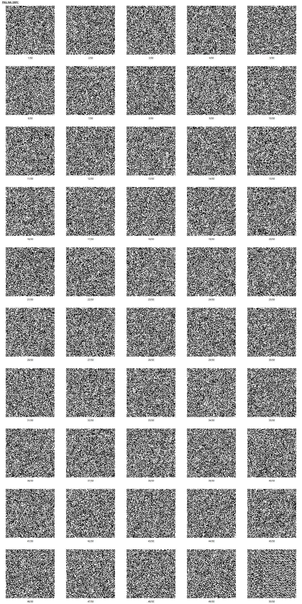

# Drop-c
## 概要
右上から転がってくる音符を音楽に合わせて叩くリズムゲームです。
プリセット4曲、アレンジ1曲、オリジナル5曲の合計10曲収録しています。

### 操作方法(メニュー)
* 十字キー上下または左右で曲選択
* Xボタンで難易度切り替え
* Aボタンでゲームを始める
* Yボタンでオートプレイを見る
* Bボタンで戻る

SELECTで強制終了せずにタイトルで「やめる」を選択して終了すると、各リソースが`CHRINIT`されます。

### 遊び方
* 「チュートリアル」があるのでそちらも見てください。
* 流れてくる音符が斜面と水平面の境界ぐらいに来たらどれかのボタンを押します。
* 色がそれぞれ違いますが押すボタンはどれでもOKです。
* また、大きい音符の場合は2個のボタンを同時に押す必要があります。
* STARTボタンで曲を途中で終了してメニューに戻ることができます。
* クリア(80000点以上)すると★が1つ、
* クリアかつフルコンボすると★が2つ、
* 全て「よい」判定でフルコンボすると★が3つもらえます。

#### チュートリアル
* ゲームの遊び方の説明が見れます。
* 曲前半はオートプレイで、後半はプレイヤーがプレイしてください。
* 選んだ難易度によって少し変わります。

### 収録曲
ゲームを進めるとプレイできる曲が増えていきます。
* チュートリアル CalcA (オリジナル)
* BGM19 (プリセット)
* レトロチックタイムループR (オリジナル)
* BGM03 (プリセット)
* リズミカル☆チェリー (オリジナル)
* BGM29 (プリセット)
* #fe2c30 (オリジナル)
* BGM03 (プリセット アレンジ)
* レトロチックタイムループS (オリジナル)
* BGM20 (プリセット)

## QR コード
プチコンmkII 向けの QR コードです。

パッケージパラメーターは`73FC`です。

## プログラムリスト

[PRG:NA_DRPC](NA_DRPC.prg)
