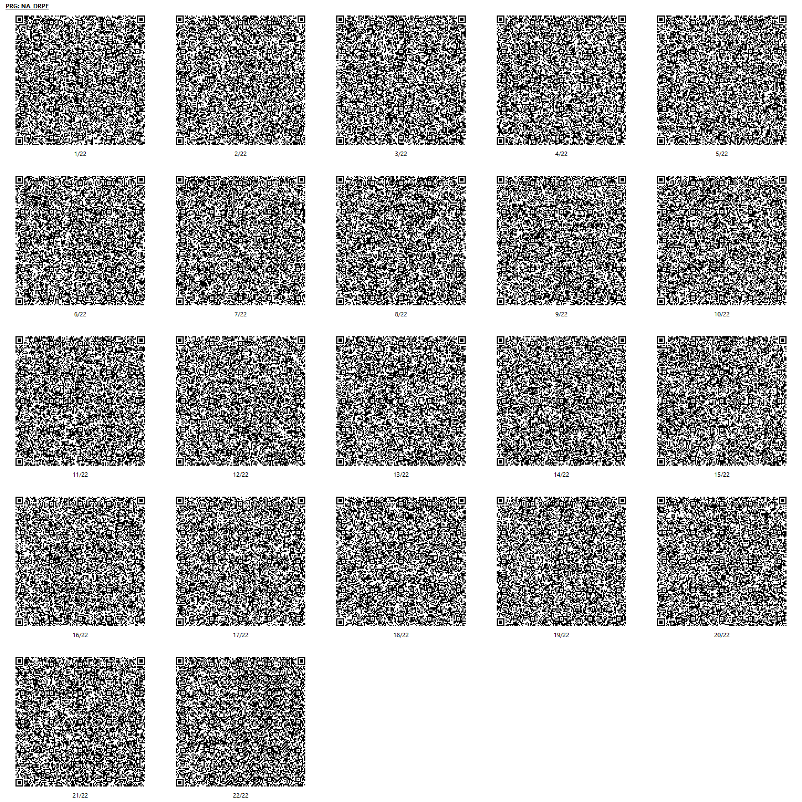

# Drop-e
## 概要
右上からシューティングのザコ敵みたいなものが流れてくるので音楽に合わせてボタンを押すだけの簡単なリズムゲームです。
プリセット3曲、アレンジ1曲、オリジナル3曲の合計7曲収録しています。

### 操作方法(メニュー)
* 十字キー上下で曲選択
* 十字キー左右で難易度選択(かんたん、むずいの2つ)
* Aボタンでゲームを始める
* Yボタンでオートプレイを見る
* Bボタンでタイトルに戻る

SELECTで強制終了せずにタイトルで「やめる」を選択して終了すると、各リソースが`CHRINIT`されます。

### 遊び方
* 流れてくるザコ敵が斜面と水平面の境界ぐらいに来たらどれかのボタンを押します。
* 色がそれぞれ違いますが押すボタンはどれでもOKです。
* また、大きめのザコ敵の場合は2個のボタンを同時に押す必要があります。
* 精度(よい、ふつう、だめ)の判定によって爆発エフェクト?が違います。
* クリア(80000点以上)すると★が1つ、
* クリアかつフルコンボすると★が2つ、
* 全て「よい」判定でフルコンボすると★が3つもらえます。
* STARTボタンで曲を途中で終了してメニューに戻ることができます。

### 収録曲
* BGM14 (プリセット)
* リズミカル☆チャイム (オリジナル、3号より移植)
* BGM11 (プリセットのアレンジ)
* Get Started! ver.3 (オリジナル、3号で公開した曲のリメイク)
* BGM23 (プリセット)
* BGM02 (プリセット)
* かわりゆくもの (オリジナル)

タイトルBGM→ リズミカル☆リリーブ(PSGver.) (オリジナル)

## QR コード
プチコンmkII 向けの QR コードです。

パッケージパラメーターは`11302`です。

### プログラムリスト

n/a
