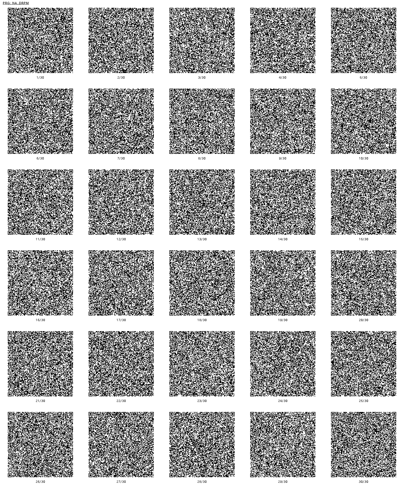

# Drop-m
## 概要
右上から転がってくる音符を音楽に合わせて叩くリズムゲームです。
プリセット3曲、オリジナル4曲の合計7曲収録しています。

### 前作との違い
* 収録曲が完全に違います。
* 今作では全体的に1曲ごとの長さを短めにしました。
* グラフィックやフォントが全体的に変わりました。
* 「チャレンジモード」「チュートリアル」を追加しました。

### 操作方法(メニュー)
* 十字キー上下で曲選択
* Xボタン、または十字キー左右で難易度選択(かんたん=水色背景、むずい=橙色背景 の2つ)
* Aボタンでゲームを始める
* Yボタンでオートプレイを見る(フリープレイのみ)
* Bボタンで戻る

SELECTで強制終了せずにタイトルで「やめる」を選択して終了すると、各リソースが`CHRINIT`されます。

### 遊び方
* 「チュートリアル」があるのでそちらも見てください。
* 流れてくる音符が斜面と水平面の境界ぐらいに来たらどれかのボタンを押します。
* 色がそれぞれ違いますが押すボタンはどれでもOKです。
* また、大きい音符の場合は2個のボタンを同時に押す必要があります。
* STARTボタンで曲を途中で終了してメニューに戻ることができます。

#### フリープレイ
* 曲と難易度を選んでプレイする、前作と同じモードです。
* クリア(80000点以上)すると★が1つ、
* クリアかつフルコンボすると★が2つ、
* 全て「よい」判定でフルコンボすると★が3つもらえます。

#### チャレンジ
* 7曲連続でプレイします。
* プレイ画面にHPゲージが表示され、HPが0になるとゲームオーバーです。
* HPは「よい」「ふつう」判定で回復し、「だめ」「ミス」判定で減ります。
* 曲が終了してもHPは回復せず、そのまま次の曲に引き継がれます。
* 音符を叩くと「スコア」の代わりに「MP」が増えます。パーフェクト時で1曲あたり最大150点になります。
* それぞれの曲の前後に、キャラクターのちょっとしたアニメーション(ストーリー)が見れます。
* 曲の結果(クリア・フルコンボ・パーフェクト)によって、キャラの動きやセリフが少し変わります。

#### チュートリアル
* ゲームの遊び方の説明が見れます。
* 曲前半はオートプレイで、後半はプレイヤーがプレイしてください。
* 選んでいる難易度(背景の色)によってチュートリアルも少し難易度が変わります。

### 収録曲
* BGM00 (プリセット)
* プチコマジック！ (オリジナル、3号より移植)
* BGM25 (プリセット)
* きょこうのりすたーと (オリジナル、3号で公開した曲*1のアレンジ)
* BGM22 (プリセット)
* Sudden (オリジナル)
* Limitelody (オリジナル)

その他にもタイトル画面、チャレンジモードのストーリー中のBGMなど、オリジナルの曲がいくつかあります。

## QR コード
プチコンmkII 向けの QR コードです。

パッケージパラメーターは`F3E4`です。

## プログラムリスト

n/a
